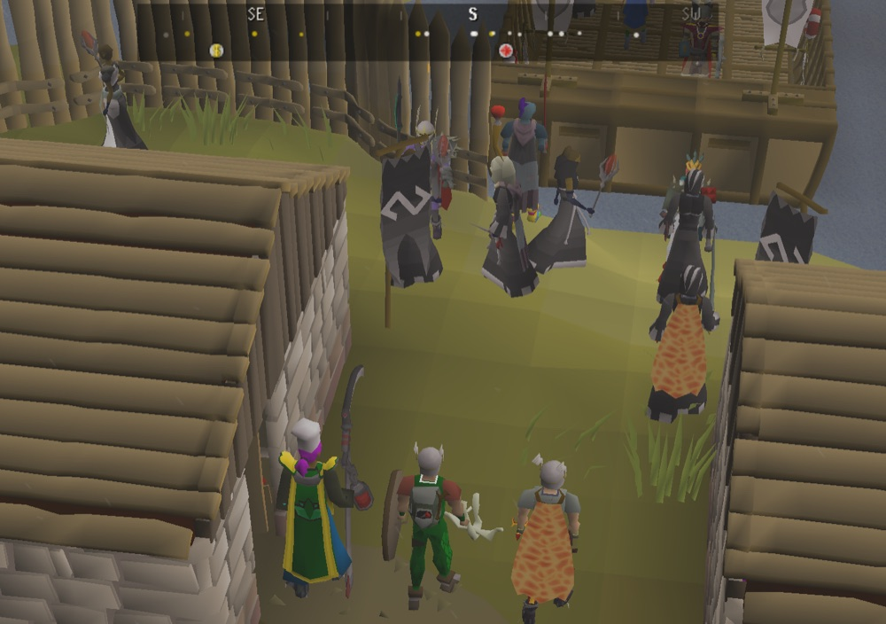
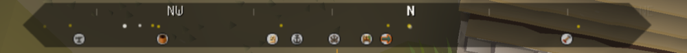

# Wayfarer Compass

A Skyrim-style compass strip for RuneLite.

A heading tape sits at the top of the game view. A fixed amber caret marks where your camera points,
and the directions (N, NE, E, SE, S, SW, W, NW) slide beneath it as you turn. Nearby players, NPCs,
drops and landmarks ride along underneath, each in its own direction, so you can tell at a glance
what's around you and which way it is.

## What it shows

**Dots**, in the middle row:

| Dot | Meaning |
|---|---|
| White | Another player |
| Orange | An NPC you can attack |
| Yellow | Any other NPC |
| Red | Items on the ground, such as drops (one dot per tile, like the minimap) |

**Map icons**, in the bottom row: the same bank, altar and shop icons your minimap draws, pointing the
way to each one.

Only things that already appear on your minimap are marked.

### How it behaves

- **Near and far.** By default, distant dots sit higher in their row, like things on the horizon.
  Dots within the last few tiles fade down, since you can already see them on screen.
- **Calm movement.** Dots glide rather than jump, and never cross more than half the strip in a
  second. Turning your camera still moves everything instantly.
- **Crowds.** A crowd standing on one spot shows as one dot, not a growing blob.
- **Passing through.** When someone runs straight through you, their dot fades back in on the other
  side instead of sliding the long way round.
- **Rows come and go.** Each row only exists while something uses it. Turn off every dot type and
  the icons move up under the letters; turn the icons off too and you get a slim directions-only strip.

## Settings

### Strip

| Setting | Default | What it does |
|---|---|---|
| Shape | Pill | *Pill*, *Square* or *Pointed* ends |
| Length | Longsword | *Dagger*, *Scimitar*, *Longsword* or *Godsword*, shortest to longest |
| Centre on game view | On | Pins the strip to the true top centre. RuneLite's own top-centre spot sits a little left of centre, because it centres on the area beside the minimap |
| Background opacity | 54% | How solid the strip is. 54% is the lightest setting where the letters stay clearly readable over bright fog, sand and pale stone |

### Markers

| Setting | Default | What it does |
|---|---|---|
| Players, Monsters, Other NPCs, Ground items | On | Each kind of dot has its own switch and colour picker (with transparency) |
| Range | 20 tiles | How far away something can be and still get a dot (4 to 50) |
| Distance as height | On | Distant dots sit higher in their row |
| Distance as size | Off | Distant dots draw smaller |
| Range follows zoom | Off | Zooming in narrows the range to the nearest third or so (never under 4 tiles), the way the minimap shows less as it zooms in |
| Shrink when zoomed out | Off | Like looking down from higher up: the further out you zoom, the smaller every dot |

### Map icons

| On by default | Off by default |
|---|---|
| Banks (and the Grand Exchange) | Rare trees, Transport, Skilling, Minigames |
| Altars | Slayer masters, Quests, Dungeons |
| Shops | Services (tutors, estate agent, makeovers) |

Icons always reach your full Range, whatever your zoom.

The **Reset** button at the bottom of the settings panel puts everything back to the defaults. To move
the strip, turn off **Centre on game view**, then hold Alt (Option on a Mac) and drag, the way RuneLite
moves any overlay; Alt+right-click puts it back.

## What it doesn't do

It only draws. It never moves your camera, clicks, or sends anything to the game, and it shows nothing
your minimap doesn't already show.

## Building

Needs Java 11. Run `./gradlew build` to build and test, or `./gradlew run` to launch a development
client with the plugin loaded.

## License

BSD 2-Clause. See [LICENSE](LICENSE).
